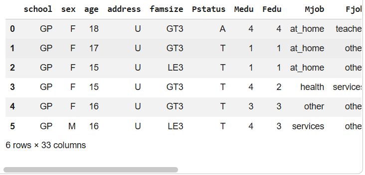
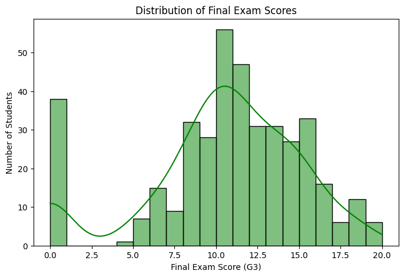
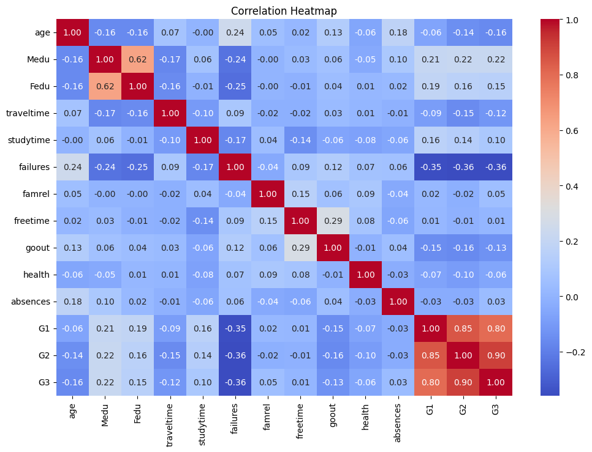
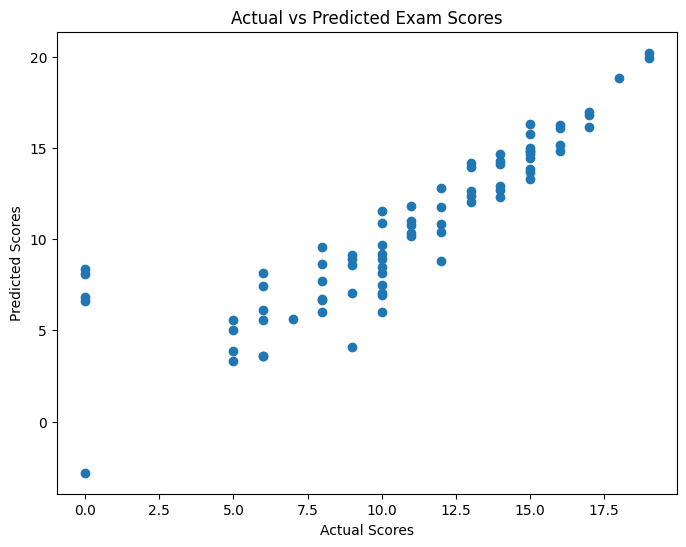
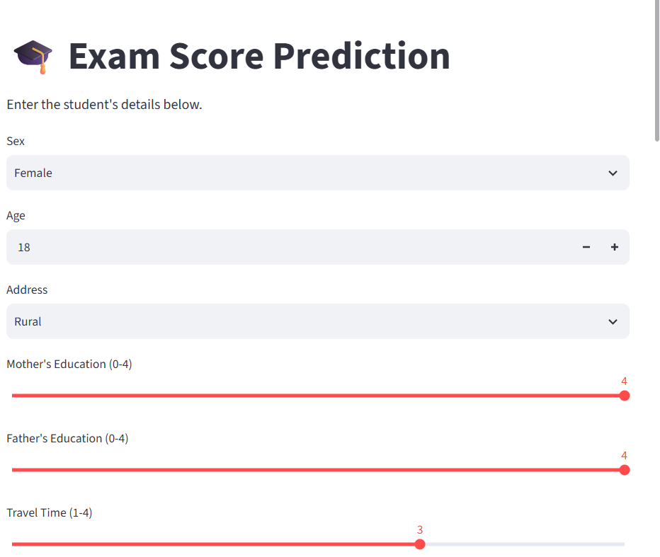

# 📘 Exam Score Prediction Using Linear Regression

## 📌 Project Overview

This project predicts students' final exam scores (G3) using the **Linear Regression** machine learning algorithm. The project follows the complete machine learning workflow, including data cleaning, exploratory data analysis (EDA), preprocessing, model training, evaluation, and deployment using **Streamlit**.

---

## 🎯 Objective

To build a machine learning model that predicts students' final exam scores based on academic, personal, and family-related factors, and deploy it as an interactive web application.

---

## 🛠️ Technologies Used

- Python
- Google Colab
- Pandas
- NumPy
- Matplotlib
- Seaborn
- Scikit-learn
- Joblib
- Streamlit

---

# 📊 Dataset Preview

---

# 🔍 Exploratory Data Analysis

## Distribution of Final Exam Scores

**Observation**

- Most students scored in the middle range.
- The distribution is approximately normal.

---

## Correlation Heatmap

**Observation**

- G1 and G2 have the strongest positive correlation with G3.
- Previous failures show a negative correlation with the final exam score.

---

# 🤖 Machine Learning Workflow

- Data Collection
- Data Cleaning
- Exploratory Data Analysis (EDA)
- Label Encoding
- Feature Selection
- Train-Test Split
- Linear Regression Model
- Prediction
- Model Evaluation
- Model Saving using Joblib
- Streamlit Deployment

---

# 📈 Model Performance

## Actual vs Predicted Scores

The scatter plot shows that the predicted scores closely follow the actual exam scores, indicating that the model performs reasonably well on unseen data.

### Evaluation Metrics

- Mean Absolute Error (MAE)
- Mean Squared Error (MSE)
- Root Mean Squared Error (RMSE)
- **R² Score ≈ 0.75**

---

# 🌐 Streamlit Web Application

The trained model was saved using **Joblib** as `exam_score_model.pkl` and deployed using **Streamlit**.

The web application allows users to:

- Enter student information
- Predict the final exam score instantly
- Interact with the trained machine learning model through a simple user interface

## Application Preview

---

# 📚 Key Learnings

Through this project, I gained practical experience in:

- Data Cleaning using Pandas
- Exploratory Data Analysis (EDA)
- Data Visualization
- Label Encoding
- Linear Regression
- Model Evaluation
- Saving Machine Learning Models using Joblib
- Building Interactive Web Applications using Streamlit
- Deploying Machine Learning Models

---

# ✅ Conclusion

This project demonstrates the complete end-to-end machine learning workflow, from data preprocessing and visualization to model training, evaluation, and deployment. It helped me gain hands-on experience in developing and deploying a machine learning application using Python and Streamlit.

---

## 👩‍💻 Author

**Hafsa Mohammed Afzal**

Engineering Student | Data Analytics & Machine Learning Enthusiast
